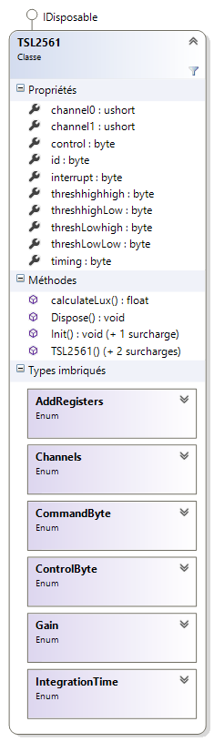

# TSL2561

<strong>Description</strong>
-------------------------------------
Source code.

A <strong>.NETMF v4.3 class</strong> write for a TSL2561 circuit : <strong>LIGHT-TO-DIGITAL CONVERTER for I²C-bus</strong>. 

This class is also in the <a href="https://www.nuget.org/packages/WEBGE.Microtoolskit/" target="_blank">MicroToolsKit</a> <strong>library</strong>. Download at <a href="https://www.nuget.org" target="_blank">nuget.com</a>

 

<strong>Hardware</strong>
---------------------
<strong> Targets </strong>: Netduino, Netduino plus 2, Netduino 3, FEZ PANDA 3 et COBRA 3.

<strong>Software</strong>
---------------------
<ul>
<li><strong>Language</strong> : C#</li>
<li><strong>Framework used</strong> : .NETMF 4.3</li>
<li><strong>IDE</strong> : Visual Studio Community 2015</li>
<li><strong>xml</strong> : documentation inside class </li> 
</ul>

<strong> Visual Studio solution</strong>
-------------------------------------
<ul>
<li><strong>TSL2561</strong>
<ul>
<li><strong>TSL2561</strong> : .NetMF class</li>

<li><strong>Netduino</strong> : class test program for Netduino board (todo)</li>
<li><strong>FezPanda</strong> : class test program for Fez Panda board (todo)</li>
</ul>
</li>
</ul>

<strong>Assembly</strong>
--------------------------
To come up

<strong>Video</strong>
-------------------
To come up

<strong>Keywords</strong>
----------------------------
I²C Bus, LIGHT-TO-DIGITAL CONVERTER, Netduino, FEZ, PANDA, COBRA, C#, NETMF, Visual Studio.

<strong>Tested on</strong>
-------------------
Fez Panda III, Netduino plus 2

<strong>Todo list</strong>
-------------------
Exception if transaction failed

<strong>To get started</strong>
--------------------
See <a href="http://webge.github.io/TSL2561/" target="_blank">TSL2561 GitHub Pages</a> (in French).

<strong>Wiki</strong>
--------------------
See <a href="https://csharpembarquenetduino.wikispaces.com/Home" target="_blank">Netduino et FEZ</a> (in French).

<strong>Project site</strong>
--------------------
<a href ="https://csharpembarquenetduino.wikispaces.com/6.+MicroToolsKit+library">MicroToolsKit library</a> (in English).

Maintened by <a href="mailto:philippemariano@gmail.com">WebGE</a>
